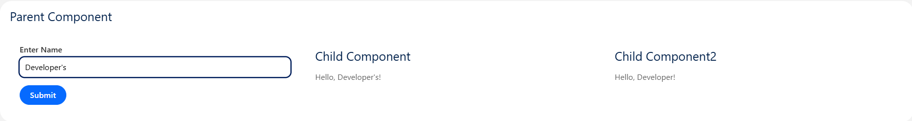

← [Back to Index](../README.md)

---

## 1. Parent → Child Communication Component

| Property | Value |
|--------|--------|
| **Component Name** | `testContComp` |
| **Category** | Component Communication |
| **Type** | Utility / Learning Component |
| **Description** | Demonstrates two common patterns for communication between Lightning Web Components: passing data to a child using `@api` properties and directly accessing a child component using `querySelector`. |

---

### Use Cases

- **Parent → Child Data Passing** — Pass data dynamically using component attributes.
- **Imperative Child Method Access** — Use `querySelector` to interact with a child component directly.
- **Dynamic UI Updates** — Update multiple child components from a single parent input.
- **Reusable Form Components** — Share input data across multiple UI blocks.

---

### Implementation

#### Parent — `testContComp.html`

```html
<template>
    <lightning-card title="Parent Component">
        <div class="slds-grid slds-m-around_medium">
            <div class="slds-col slds-m-around_small">
                <lightning-input type="text" label="Enter Name" value={inputText} onchange={handleChange}>
                </lightning-input>
                <button class="slds-button slds-button_brand slds-m-top_small" onclick={sendToChild2}>
                    Submit
                </button>
            </div>
            <div class="slds-col slds-m-around_small">
                <c-test-child-comp name={inputText}></c-test-child-comp>
            </div>
            <div class="slds-col slds-m-around_small">
                <c-test-child-two-comp></c-test-child-two-comp>
            </div>
        </div>
    </lightning-card>
</template>
```

#### Parent — `testContComp.js`

```javascript
import { LightningElement } from 'lwc';

export default class TestContComp extends LightningElement {
    inputText = 'Sibun';

    handleChange(event) {
        this.inputText = event.target.value;
    }
    sendToChild2() {
        let childComp = this.template.querySelector('c-test-child-two-comp');
        childComp.name = this.inputText;
    }
}
```

#### Child 1 (Property Binding) — `testChildComp.html`

```html
<template>
    <lightning-card title="Child Component 1">
        <div class="slds-m-left_small">
            Hello, {name}!
        </div>
    </lightning-card>
</template>
```

#### Child 1 — `testChildComp.js`

```javascript
import { LightningElement, api } from 'lwc';

export default class TestChildComp extends LightningElement {
    @api name;
}
```

#### Child 2 (Imperative Access) — `testChildTwoComp.html`

```html
<template>
    <lightning-card title="Child Component 2">
        <div class="slds-m-left_small">
            Hello, {name}!
        </div>
    </lightning-card>
</template>
```

#### Child 2 — `testChildTwoComp.js`

```javascript
import { LightningElement, api } from 'lwc';

export default class TestChildTwoComp extends LightningElement {
    @api name = '';
}
```

---

### Preview


