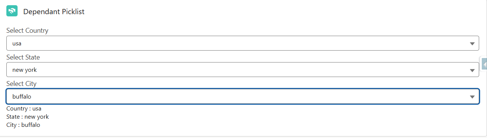

← [Back to Index](../README.md)

---

## 5. Dependent Picklist Component

| Property | Value |
|--------|--------|
| **Component Name** | `dependantPicklistComp` |
| **Category** | Form / Data Selection |
| **Type** | Utility Component |
| **Description** | A reusable Lightning Web Component that implements a three-level dependent picklist (Country → State → City) using Apex data. The component dynamically enables and disables fields based on the user's selection. |

---

### Use Cases

- **Address Forms** — Dynamically select Country → State → City.
- **Customer Registration Systems** — Capture hierarchical location information.
- **Lead / Account Creation** — Improve data accuracy with dependent selections.
- **Survey or Data Collection Apps** — Guide users through structured input.

---

### Implementation

#### `dependantPicklistComp.html`

```html
<template>
    <lightning-card title="Dependant Picklist" icon-name="custom:custom14">
        <div class="slds-m-around_medium">
            <lightning-combobox
                label="Select Country"
                value={country}
                options={countryOptions}
                onchange={handleCountryChange}>
            </lightning-combobox>
            <lightning-combobox
                label="Select State"
                value={state}
                options={stateOptions}
                onchange={handleStateChange}
                disabled={isStateDisabled}>
            </lightning-combobox>
            <lightning-combobox
                label="Select City"
                value={city}
                options={cityOptions}
                onchange={handleCityChange}
                disabled={isCityDisabled}>
            </lightning-combobox>
            <template if:true={city}>
                <p>Country : {country}</p>
                <p>State : {state}</p>
                <p>City : {city}</p>
            </template>
        </div>
    </lightning-card>
</template>
```

#### `dependantPicklistComp.js`

```javascript
import { LightningElement, wire, track } from 'lwc';
import getLocation from '@salesforce/apex/locationController.getLocation';

export default class DependantPicklistComp extends LightningElement {
    @track allData;
    @track countryOptions = [];
    @track stateOptions = [];
    @track cityOptions = [];
    @track country = '';
    @track state = '';
    @track city = '';

    @wire(getLocation)
    wireData({ error, data }) {
        if (data) {
            this.allData = data;
            this.countryOptions = Object.keys(data).map(item => ({
                label: item,
                value: item
            }));
        } else if (error) {
            console.error('Error fetching data:', error);
        }
    }

    get isStateDisabled() {
        return !this.country;
    }
    get isCityDisabled() {
        return !this.state;
    }
    handleCountryChange(event) {
        this.country = event.target.value;
        this.stateOptions = Object.keys(this.allData[this.country]).map(item => ({
            label: item,
            value: item
        }));
        this.state = '';
        this.city = '';
        this.cityOptions = [];
    }
    handleStateChange(event) {
        this.state = event.target.value;
        this.cityOptions = this.allData[this.country][this.state].map(item => ({
            label: item,
            value: item
        }));
        this.city = '';
    }
    handleCityChange(event) {
        this.city = event.target.value;
    }
}
```

#### `locationController.cls`

```apex
public with sharing class locationController {
    @AuraEnabled(cacheable=true)
    public static Map<String,Map<String,List<String>>> getLocation() {
        Map<String,Map<String,List<String>>> data = new Map<String,Map<String,List<String>>>();
        data.put('india', new Map<String,List<String>>{
            'karnataka' => new List<String>{'bangalore','mysore','hubli'},
            'tamilnadu' => new List<String>{'chennai','coimbatore','madurai'}
        });
        data.put('usa', new Map<String,List<String>>{
            'california' => new List<String>{'san francisco','los angeles','san diego'},
            'new york'   => new List<String>{'new york city','buffalo','albany'}
        });
        data.put('uk', new Map<String,List<String>>{
            'england'  => new List<String>{'london','manchester','birmingham'},
            'scotland' => new List<String>{'glasgow','edinburgh','dundee'}
        });
        data.put('australia', new Map<String,List<String>>{
            'new south wales' => new List<String>{'sydney','wollongong','perth'},
            'queensland'      => new List<String>{'brisbane','gold coast','sunshine coast'}
        });
        return data;
    }
}
```

---

### Preview


