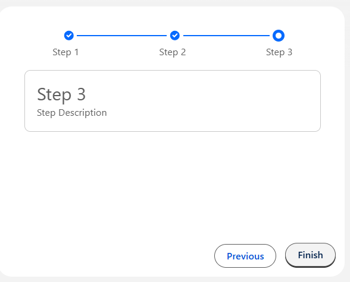

← [Back to Index](../README.md)

---

## 6. Multi Step Progress Form

| Property | Value |
|--------|--------|
| **Component Name** | `lwcContainer` |
| **Category** | Form / Workflow |
| **Type** | Utility Component |
| **Description** | A reusable Lightning Web Component that implements a step-based UI workflow using the Lightning Progress Indicator. It allows users to navigate between multiple steps and complete a process sequentially. |

---

### Use Cases

- **Multi-Step Form Wizards** — Guide users through complex form submissions.
- **Record Creation Processes** — Create records step by step (Account → Contact → Opportunity).
- **Checkout or Registration Flows** — Divide long forms into multiple logical steps.
- **Guided Data Entry Systems** — Ensure users complete required sections before submission.

---

### Implementation

#### Container — `lwcContainer.html`

```html
<template>
    <lightning-card>
        <div class="slds-m-around_medium">
            <lightning-progress-indicator current-step={currentStep} value="100" variant="base">
                <lightning-progress-step label="Step 1" value="1"></lightning-progress-step>
                <lightning-progress-step label="Step 2" value="2"></lightning-progress-step>
                <lightning-progress-step label="Step 3" value="3"></lightning-progress-step>
            </lightning-progress-indicator>
            <div style="display: flex; justify-content: space-around; text-align:center; font-size:13px;">
                <div>Step 1</div>
                <div>Step 2</div>
                <div>Step 3</div>
            </div>
        </div>
        <div class="slds-m-around_medium" style="min-height: 30dvh;">
            <template if:true={isStepOne}>
                <c-first-step-comp></c-first-step-comp>
            </template>
            <template if:true={isStepTwo}>
                <c-second-step-comp></c-second-step-comp>
            </template>
            <template if:true={isStepThree}>
                <c-third-step-comp></c-third-step-comp>
            </template>
        </div>
        <div class="slds-grid slds-grid_align-end slds-m-horizontal_small">
            <template if:false={previousDisabled}>
                <span class="slds-m-around_small">
                    <lightning-button label="Previous" onclick={handlePrevious}></lightning-button>
                </span>
            </template>
            <template if:false={nextDisabled}>
                <span class="slds-m-around_small slds-m-left_small">
                    <lightning-button label="Next" onclick={handleNext}></lightning-button>
                </span>
            </template>
            <template if:true={isLastStep}>
                <span class="slds-m-around_small slds-m-left_small">
                    <lightning-button label="Finish" onclick={handleSubmit}></lightning-button>
                </span>
            </template>
        </div>
    </lightning-card>
</template>
```

#### Container — `lwcContainer.js`

```javascript
import { LightningElement } from 'lwc';
import { ShowToastEvent } from 'lightning/platformShowToastEvent';

export default class LwcContainer extends LightningElement {
    currentStep = "1";
    previousDisabled = true;
    nextDisabled = false;
    isLastStep = false;

    handleNext() {
        if (this.currentStep == "1") {
            this.currentStep = "2";
            this.previousDisabled = false;
        } else if (this.currentStep == "2") {
            this.currentStep = "3";
            this.nextDisabled = true;
            this.isLastStep = true;
        }
    }
    handlePrevious() {
        if (this.currentStep == "2") {
            this.currentStep = "1";
            this.previousDisabled = true;
        } else if (this.currentStep == "3") {
            this.currentStep = "2";
            this.nextDisabled = false;
            this.isLastStep = false;
        }
    }
    get isStepOne() {
        return this.currentStep == "1";
    }
    get isStepTwo() {
        return this.currentStep == "2";
    }
    get isStepThree() {
        return this.currentStep == "3";
    }
    handleSubmit() {
        this.dispatchEvent(
            new ShowToastEvent({
                title: 'Success',
                message: 'Submitted',
                variant: 'success',
            })
        );
    }
}
```

#### Step Components

`firstStepComp.html`

```html
<template>
    <div class="slds-m-around_medium slds-box slds-border_around">
        <div class="slds-text-heading_medium">Step 1</div>
        <div class="slds-text-body_regular">Step 1 Description</div>
    </div>
</template>
```

`secondStepComp.html`

```html
<template>
    <div class="slds-m-around_medium slds-box slds-border_around">
        <div class="slds-text-heading_medium">Step 2</div>
        <div class="slds-text-body_regular">Step 2 Description</div>
    </div>
</template>
```

`thirdStepComp.html`

```html
<template>
    <div class="slds-m-around_medium slds-box slds-border_around">
        <div class="slds-text-heading_medium">Step 3</div>
        <div class="slds-text-body_regular">Step 3 Description</div>
    </div>
</template>
```

---

### Preview


