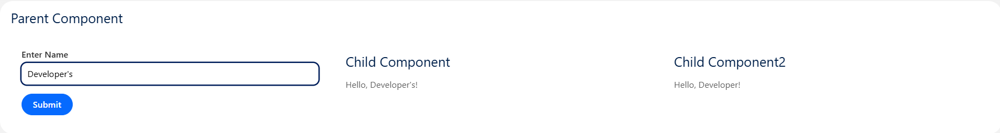
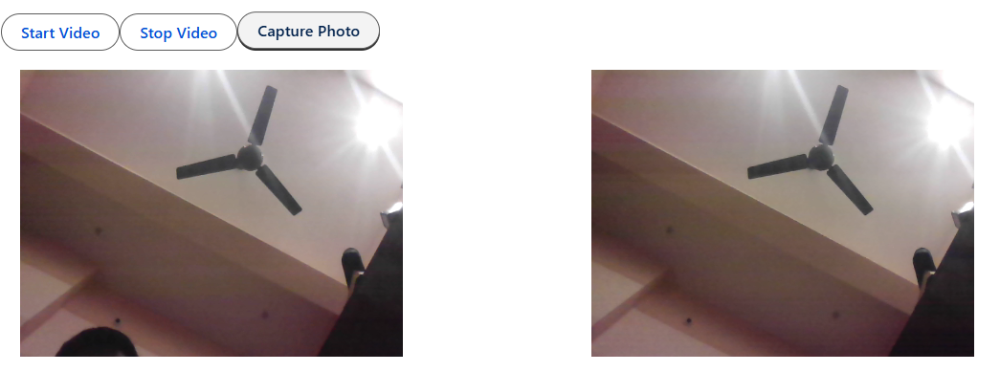
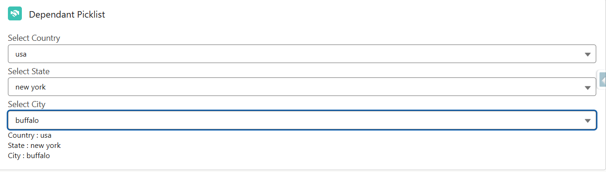
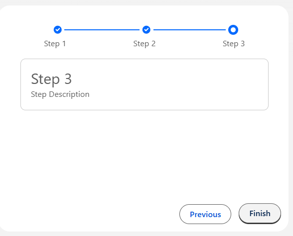

# 🧩 LWC Utility Components Library

A personal collection of reusable **Lightning Web Components (LWC)** that can be quickly integrated into Salesforce projects without rewriting code from scratch.

This documentation will grow over time as more reusable components are added.

---

# 📚 Component Index

| # | Component | Description |
|---|---|---|
| 1 | [Parent → Child Communication Component](#1️⃣-lwc-parent-child-communication-component-) | Demonstrates data passing between parent and child components using @api |
| 2 | [WebCam Image Capture Component](#2️⃣-lwc-webcam-image-capture-component-) | Capture images directly from the user's webcam using MediaDevices API |
| 3 | [Dependent Picklist Component](#3️⃣-lwc-dependent-picklist-component-) | Dynamic Country → State → City dependent picklist |
| 4 | [Multi Step Progress Form](#4️⃣-lwc-multi-step-progress-form-) | Step based UI workflow using Lightning Progress Indicator |

---


# 1 LWC Parent Child Communication Component 🔗

| Property | Value |
|--------|--------|
| **Component Name** | `testContComp` |
| **Category** | Component Communication |
| **Type** | Utility / Learning Component |
| **Description** | Demonstrates two common patterns for communication between Lightning Web Components: passing data to a child using `@api` properties and directly accessing a child component using `querySelector`. |

---

# 🚀 Use Cases

This component demonstrates useful Salesforce UI interaction patterns:

- **Parent → Child Data Passing**  
  Pass data dynamically using component attributes.

- **Imperative Child Method Access**  
  Use `querySelector` to interact with a child component directly.

- **Dynamic UI Updates**  
  Update multiple child components from a single parent input.

- **Reusable Form Components**  
  Share input data across multiple UI blocks.

---

# 🛠 Implementation

## Parent Component

### HTML Template  
`testContComp.html`

```html
<template>
    <lightning-card title="Parent Component">
        <div class="slds-grid slds-m-around_medium">
            <div class="slds-col slds-m-around_small">
                <lightning-input type="text"
                                 label="Enter Name"
                                 value={inputText}
                                 onchange={handleChange}>
                </lightning-input>
                <button class="slds-button slds-button_brand slds-m-top_small"
                        onclick={sendToChild2}>
                    Submit
                </button>
            </div>
            <div class="slds-col slds-m-around_small">
                <c-test-child-comp name={inputText}></c-test-child-comp>
            </div>
            <div class="slds-col slds-m-around_small">
                <c-test-child-two-comp></c-test-child-two-comp>
            </div>
        </div>
    </lightning-card>
</template>
```

---

### JavaScript Controller  
`testContComp.js`

```javascript
import { LightningElement } from 'lwc';
export default class TestContComp extends LightningElement {
    inputText = 'Sibun';
    handleChange(event){
        this.inputText = event.target.value;
    }
    sendToChild2(){
        let childComp = this.template.querySelector('c-test-child-two-comp');
        childComp.name = this.inputText;
    }
}
```

---

# Child Components

## Child Component 1 (Property Binding)

### HTML  
`testChildComp.html`

```html
<template>
    <lightning-card title="Child Component2">
        <div class="slds-m-left_small">
            Hello, {name}!
        </div>
    </lightning-card>
</template>
```

### JavaScript  
`testChildComp.js`

```javascript
import { LightningElement, api } from 'lwc';

export default class TestChildComp extends LightningElement {
    @api name;
}
```

---

## Child Component 2 (Imperative Access)

### HTML  
`testChildTwoComp.html`

```html
<template>
    <lightning-card title="Child Component">
        <div class="slds-m-left_small">
            Hello, {name}!
        </div>
    </lightning-card>
</template>
```

### JavaScript  
`testChildTwoComp.js`

```javascript
import { LightningElement, api } from 'lwc';

export default class TestChildTwoComp extends LightningElement {
    @api name = '';
}
```

---

# 📷 Component Preview



# 2 LWC WebCam Image Capture Component 📸

| Property | Value |
|--------|--------|
| **Component Name** | `webCamImageLwc` |
| **Category** | Media / Camera |
| **Type** | Utility Component |
| **Description** | A reusable Lightning Web Component that interfaces with the browser MediaDevices API to stream video and capture still images directly inside Salesforce UI. |

---

## 🚀 Use Cases

This component can be used in multiple real-world Salesforce scenarios:

- **Field Service**  
  Capture equipment or site photos.

- **Identity Verification**  
  Quickly capture a user photo for validation.

- **Case Documentation**  
  Attach real-time images to a Case or Lead.

- **Inspection Systems**  
  Capture product condition images.

---

## 🛠 Implementation

### HTML Template  
`webCamImageLwc.html`

```html
<template>
    <lightning-card>
        <div>
            <lightning-button label="Start Video" onclick={startCamera}></lightning-button>
            <lightning-button label="Stop Video" onclick={stopCamera}></lightning-button>
            <lightning-button label="Capture Photo" onclick={captureImage}></lightning-button>
        </div>
        <div class="slds-grid slds-p-around_medium">
            <div class="slds-col">
                <video class="videoElement" width="320" height="240" autoplay></video>
            </div>
            <div class="slds-col">
                
            </div>
            <canvas class="slds-hide canvas"></canvas>
        </div>
    </lightning-card>
</template>
```
### JavaScript Template  
`webCamImageLwc.js`

```Javascript
import { LightningElement } from 'lwc';

export default class WebCamImageLwc extends LightningElement {
    videoElement;
    imageElement;
    canvasElement;
    renderedCallback() {
        this.videoElement = this.template.querySelector('.videoElement');
        this.canvasElement = this.template.querySelector('.canvas');
    }
    async startCamera() {
        if(navigator.mediaDevices && navigator.mediaDevices.getUserMedia){
            try {
                this.videoElement.srcObject = await navigator.mediaDevices.getUserMedia({video:true,audio:false});
            } catch (error) {
                console.log('error', error);
            }
        }else{
            console.log('Get user Media is not supported');
        }
    }
    async stopCamera() {
        const video = this.template.querySelector('.videoElement');
        video.srcObject.getTracks().forEach( (track) => track.stop());
        video.srcObject = null;
        this.hideImageElement();
    }
    captureImage() {
        if(this.videoElement && this.videoElement.srcObject!=null){
            this.canvasElement.height = this.videoElement.videoHeight;
            this.canvasElement.width = this.videoElement.videoWidth;
            const context = this.canvasElement.getContext('2d');
            context.drawImage(this.videoElement,0,0,this.canvasElement.width,this.canvasElement.height);
            const imgData = this.canvasElement.toDataURL('image/png');
            const imageElement = this.template.querySelector('.imageElement');
            imageElement.setAttribute('src',imgData);
            imageElement.classList.add('slds-show');
            imageElement.classList.remove('slds-hide');
        }
    }
    hideImageElement(){
        const imageElement = this.template.querySelector('.imageElement');
        imageElement.classList.add('slds-hide');
        imageElement.classList.remove('slds-show');
    }
}
```

### 📷 Component Preview


# 3 LWC Dependent Picklist Component 🌍

| Property | Value |
|--------|--------|
| **Component Name** | `dependantPicklistComp` |
| **Category** | Form / Data Selection |
| **Type** | Utility Component |
| **Description** | A reusable Lightning Web Component that implements a three-level dependent picklist (Country → State → City) using Apex data. The component dynamically enables and disables fields based on the user's selection. |

---

# 🚀 Use Cases

This component can be used in multiple Salesforce scenarios:

- **Address Forms**  
  Dynamically select Country → State → City.

- **Customer Registration Systems**  
  Capture hierarchical location information.

- **Lead / Account Creation**  
  Improve data accuracy with dependent selections.

- **Survey or Data Collection Apps**  
  Guide users through structured input.

---

# 🛠 Implementation

## HTML Template  
`dependantPicklistComp.html`

```html
<template>
    <lightning-card title="Dependant Picklist" icon-name="custom:custom14">
        <div class="slds-m-around_medium">
            <lightning-combobox label="Select Country" value={country} options={countryOptions}
                onchange={handleCountryChange}>
            </lightning-combobox>
            <lightning-combobox label="Select State" value={state} options={stateOptions} onchange={handleStateChange}
                disabled={isStateDisabled}>
            </lightning-combobox>
            <lightning-combobox label="Select City" value={city} options={cityOptions} onchange={handleCityChange}
                disabled={isCityDisabled}>
            </lightning-combobox>
            <template if:true={city}>
                <p>Country : {country}</p>
                <p>State : {state}</p>
                <p>City : {city}</p>
            </template>
        </div>
    </lightning-card>
</template>
```

---

## JavaScript Controller  
`dependantPicklistComp.js`

```javascript
import { LightningElement, wire, track } from 'lwc';
import getLocation from '@salesforce/apex/locationController.getLocation';

export default class DependantPicklistComp extends LightningElement {
    @track allData;
    @track countryOptions = [];
    @track stateOptions = [];
    @track cityOptions = [];
    @track country = '';
    @track state = '';
    @track city = '';

    @wire(getLocation)
    wireData({ error, data }) {
        console.log('hii')
        console.log('Data:', data);
        console.log('Error:', error);
        if (data) {
            console.log('Data fetched successfully:', data);
            this.allData = data;
            this.countryOptions = Object.keys(data).map(item => ({
                label: item,
                value: item
            }));
            console.log('Country Options:', this.countryOptions);
        }
        else if (error) {
            console.error('Error fetching data:', error);
        }
    }
    
    get isStateDisabled() {
        return !this.country;
    }
    get isCityDisabled() {
        return !this.state;
    }
    handleCountryChange(event) {
        this.country = event.target.value;
        this.stateOptions = Object.keys(this.allData[this.country]).map(item => ({
            label: item,
            value: item
        }));
        this.state = '';
        this.city = '';
        this.cityOptions = [];
    }
    handleStateChange(event) {
        this.state = event.target.value;
        this.cityOptions = this.allData[this.country][this.state].map(item => ({
            label: item,
            value: item
        }));
        this.city = '';
    }
    handleCityChange(event) {
        this.city = event.target.value;
    }
}
```

---

## Apex Controller  
`locationController.cls`

```apex
public with sharing class locationController {
    @AuraEnabled(cacheable=true)
    public static Map<String,Map<String,List<String>>> getLocation(){
        Map<String,Map<String,List<String>>> data = new Map<String,Map<String,List<String>>>();
        data.put('india',new map<String,List<String>>{
            'karnataka'=>new List<String>{'bangalore','mysore','hubli'},
            'tamilnadu'=>new List<String>{'chennai','coimbatore','madurai'}
        });
        data.put('usa',new map<String,List<String>>{
            'california'=>new List<String>{'san francisco','los angeles','san diego'},
            'new york'=>new List<String>{'new york city','buffalo','albany'}
        });
        data.put('uk',new map<String,List<String>>{
            'england'=>new List<String>{'london','manchester','birmingham'},
            'scotland'=>new List<String>{'glasgow','edinburgh','dundee'}    
        });
        data.put('australia',new map<String,List<String>>{
            'new south wales'=>new List<String>{'sydney','wollongong','perth'},
            'queensland'=>new List<String>{'brisbane','gold coast','sunshine coast'}
        });
        return data;
    }
}
```

---

# 📷 Component Preview



# 4 LWC Multi Step Progress Form 🧭

| Property | Value |
|--------|--------|
| **Component Name** | `lwcContainer` |
| **Category** | Form / Workflow |
| **Type** | Utility Component |
| **Description** | A reusable Lightning Web Component that implements a step-based UI workflow using the Lightning Progress Indicator. It allows users to navigate between multiple steps and complete a process sequentially. |

---

# 🚀 Use Cases

This component can be used in many Salesforce workflows:

- **Multi-Step Form Wizards**  
  Guide users through complex form submissions.

- **Record Creation Processes**  
  Create records step by step (Account → Contact → Opportunity).

- **Checkout or Registration Flows**  
  Divide long forms into multiple logical steps.

- **Guided Data Entry Systems**  
  Ensure users complete required sections before submission.

---

# 🛠 Implementation

## Main Container Component

### HTML Template  
`lwcContainer.html`

```html
<template>
    <lightning-card>
        <div class="slds-m-around_medium">
            <lightning-progress-indicator current-step={currentStep} value="100" variant="base">
                <lightning-progress-step label="Step 1" value="1"></lightning-progress-step>
                <lightning-progress-step label="Step 2" value="2"></lightning-progress-step>
                <lightning-progress-step label="Step 3" value="3"></lightning-progress-step>
            </lightning-progress-indicator>
            <div style="display: flex; justify-content: space-around; text-align:center; font-size:13px;">
                <div>Step 1</div>
                <div>Step 2</div>
                <div>Step 3</div>
            </div>
        </div>
        <div class="slds-m-around_medium" style="min-height: 30dvh;">
            <template if:true={isStepOne}>
                <c-first-step-comp></c-first-step-comp>
            </template>
            <template if:true={isStepTwo}>
                <c-second-step-comp></c-second-step-comp>
            </template>
            <template if:true={isStepThree}>
                <c-third-step-comp></c-third-step-comp>
            </template>
        </div>
        <div class="slds-grid slds-grid_align-end slds-m-horizontal_small">
            <template if:false={previousDisabled}>
                <span class="slds-m-around_small">
                    <lightning-button label="Previous" onclick={handlePrevious}></lightning-button>
                </span>
            </template>
            <template if:false={nextDisabled}>
                <span class="slds-m-around_small slds-m-left_small">
                    <lightning-button label="Next" onclick={handleNext}></lightning-button>
                </span>
            </template>
            <template if:true={isLastStep}>
                <span class="slds-m-around_small slds-m-left_small">
                    <lightning-button label="Finish" onclick={handleSubmit}></lightning-button>
                </span>
            </template>
        </div>
    </lightning-card>
</template>
```

---

### JavaScript Controller  
`lwcContainer.js`

```javascript
import { LightningElement } from 'lwc';
import { ShowToastEvent } from 'lightning/platformShowToastEvent'

export default class LwcContainer extends LightningElement {
    currentStep = "1";
    previousDisabled = true;
    nextDisabled = false;
    isLastStep = false;
    handleNext(){
        if(this.currentStep == "1"){
            this.currentStep = "2";
            this.previousDisabled = false;
        }
        else if(this.currentStep == "2"){
            this.currentStep = "3";
            this.nextDisabled = true;
            this.isLastStep = true;
        }
    }
    handlePrevious(){
        if(this.currentStep == "2"){
            this.currentStep = "1";
            this.previousDisabled = true;
        }
        else if(this.currentStep == "3"){
            this.currentStep = "2";
            this.nextDisabled = false;
            this.isLastStep = false;
        }
    }
    get isStepOne(){
        return this.currentStep == "1";
    }
    get isStepTwo(){
        return this.currentStep == "2";
    }
    get isStepThree(){
        return this.currentStep == "3";
    }
    handleSubmit(){
        this.dispatchEvent(
            new ShowToastEvent({
                title: 'Success',
                message: 'Submitted',
                variant: 'success',
            })
        )
    }
}
```

---

# Child Step Components

## Step 1 Component  
`firstStepComp.html`

```html
<template>
    <div class="slds-m-around_medium slds-box slds-border_around">
        <div class="slds-text-heading_medium">Step 1</div>
        <div class="slds-text-body_regular">Step 1 Description</div>
    </div>
</template>
```

---

## Step 2 Component  
`secondStepComp.html`

```html
<template>
    <div class="slds-m-around_medium slds-box slds-border_around">
        <div class="slds-text-heading_medium">Step 2</div>
        <div class="slds-text-body_regular">Step 2 Description</div>
    </div>
</template>
```

---

## Step 3 Component  
`thirdStepComp.html`

```html
<template>
    <div class="slds-m-around_medium slds-box slds-border_around">
        <div class="slds-text-heading_medium">Step 3</div>
        <div class="slds-text-body_regular">Step 3 Description</div>
    </div>
</template>
```

---

# 📷 Component Preview

